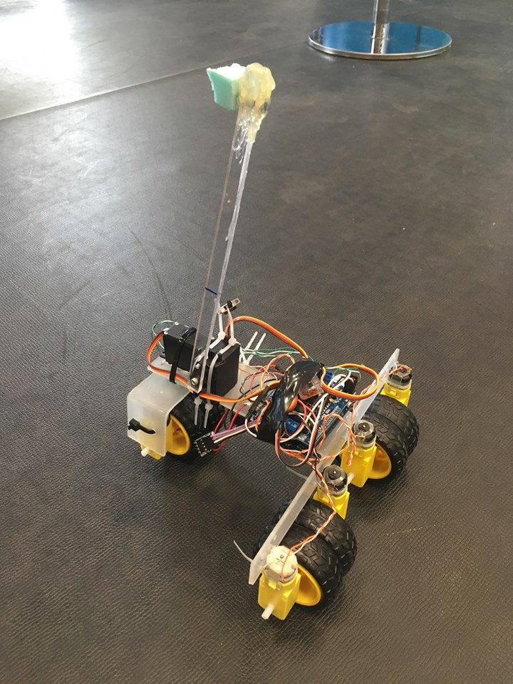

**MaM2018**

433mhz-n küldjük az utasításokat a robotnak hasonló megoldással mint 2017-ben

Robot - ez az hogy mi fut a roboton, ami az utasítokat fogadja

Controller - ez az ami küldi az utasítáokat

**Vezérlés / bekötés**

1 - sebesség +1/3 (0 esetén) - zöld D2

2 - sebesség +1/3 (0 esetén) - citrom D3

3 - sbesség +1/3 (0 esetén) - kék D4

4 - irány 1 előre / 0 a hátra - narancs D5

5 - motor kapcsolás - 0 esetén mennek a motorok - lila D6

6 - szervó csapkodás - (0 esetén le engedett pozíció) - piros D7 - külső szervó csatlakozó roboton

7 - PWM kanyarodás (0-1024) 512 közép
---- barna A0 (szürke 5V - pin7-re) - belső csatlakozó roboton

8 - NOT USED 

**HW:**
https://playground.arduino.cc/Main/AdafruitMotorShield

